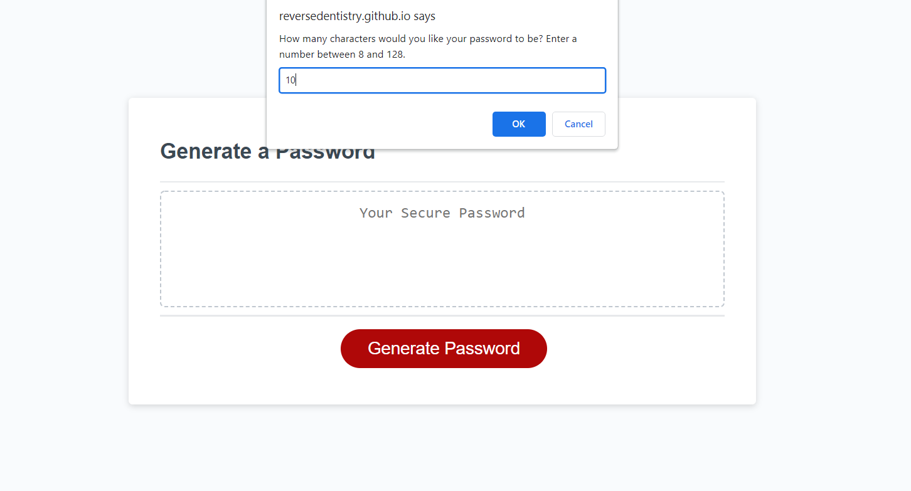
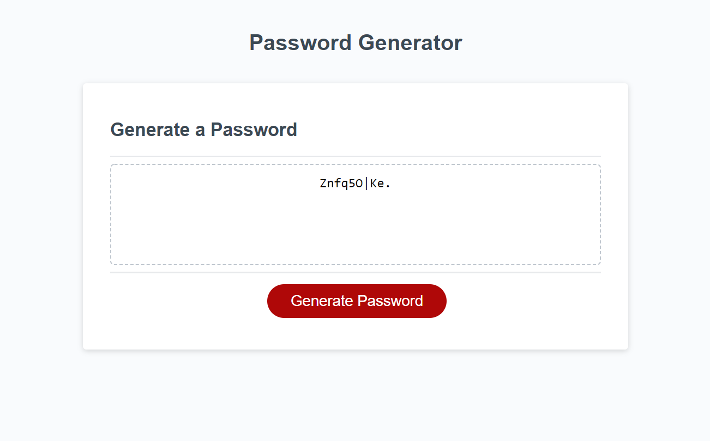

# Creating a Random Password Generator Catered to User's Choices Through Javascript 

## Description 

Javascript is a powerful tool essential for modern browser functionality. Using it, users have a higher level of interactivity with webpages and developers have more tools and tricks they can add to make a webpage more interesting to use. This project aims to create a random password generator through Javascript using character types that a user can choose to add. 

On the page, there is a textbox and a button beneath that will begin the password-generating process. Upon clicking the button, prompts will open up that ask the user how long they'd like their password to be, as well as what kind of characters they would like to be included through the use of window prompts, the options being lowercase letters, uppercase letters, special characters, and numbers. What this looks like in the backend is that each character type has an array of data that is pooled together if the user chooses to include them, and then the password is generated by randomly picking from that aggregated array with each character. The greatest challenge for this exercise was figuring out the structure of my code: because Javascript is so flexible, I tried many different ways of building functions that would group the correct arrays together. Some of the attempts ended up being quite complicated and I had to scrap and rework them to minimize possible errors and make the code as tidy as possible. Another challenge was that, unlike HTML and CSS which have visual tools to help a developer pinpoint areas to improve, Javascript doesn't seem to have as easy an equivalent when it comes to finding what to troubleshoot. To this end, I used the console within the Google Chrome developer tools as an indirect method of seeing whether my functions were running correctly by logging the resulting output like the customized arrays. 

The result is perfectly functional, but in the future I would like to tweak the final loop iteration for password generation. There is a small flaw within this method of pooling arrays: because the quantity of numbers to choose from is relatively small compared to the pools of the other character types, for users who choose a password with lower character limits, even if they would like to include numbers there is still a chance the final result will not have any simply due to probability. I'd like to add in a way to force at least one number into a generated password should users choose the option. 

## Technologies 
- HTML (template provided)
- CSS (template provided)
- Javascript 
- Chrome Developer Tools 

### Image of Final Page

### Github Link for Application 
[Link to final Github application](https://reversedentistry.github.io/Random-Password-Generator-Using-Javascript/)